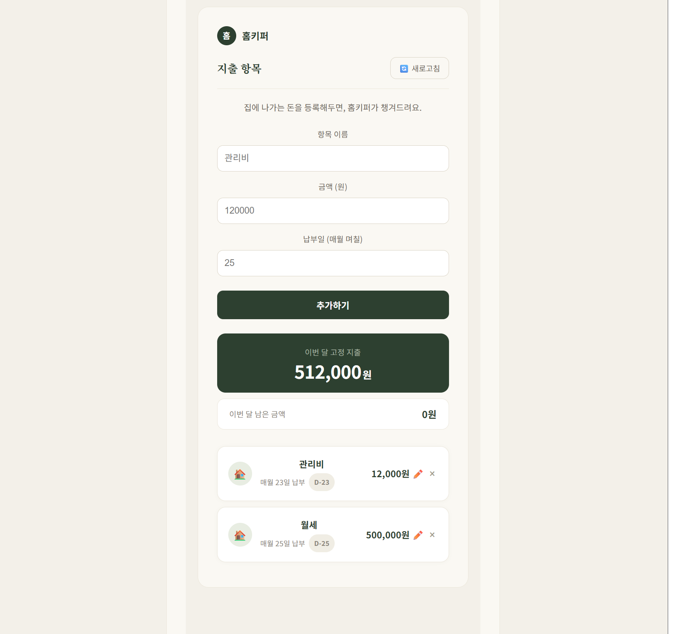
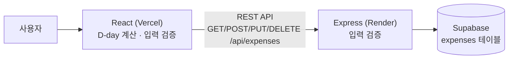

# 🏠 홈키퍼 (HomeKeeper)

> 월세·관리비처럼 매달 나가는 고정 지출을 등록해두면, 납부일까지 남은 날을 D-day로 보여주고 임박한 지출을 먼저 알려주는 웹 서비스

**네이버 커넥트재단 AI Agent Challenge (2026.07 ~ 2026.08, 4주 개인 프로젝트)**
> 챌린지 공용 저장소에서 개인 브랜치로 개발한 뒤 이 저장소로 옮겨왔습니다. Contributors에 표시되는 `crongro`(운영진의 PR 템플릿 커밋)와 `github-actions[bot]`(PR 자동 머지)은 챌린지 운영용 기록이며, 서비스 기획과 코드 작성은 모두 개인 작업입니다.


| 항목 | 링크 |
|---|---|
| 🌐 배포 | https://hub-kappa-azure.vercel.app |
| 🎬 시연 영상 | [Google Drive](https://drive.google.com/file/d/1EbAvKz1XsuQSksGtq-qzWCnEJ5h69lCG/view?usp=sharing) |



---

## 💡 어떤 문제를 풀었나요

처음 자취를 시작한 대학생과 사회초년생은 월세·관리비 같은 고정 지출의 **납부일을 놓치기 쉽고**, 이번 달에 **아직 나갈 돈이 얼마인지** 한눈에 알기 어렵습니다.

홈키퍼는 고정 지출을 한 번만 등록하면 매달 납부일을 자동으로 계산해, **"무엇을, 언제까지, 얼마" 내야 하는지**를 한 화면에 보여줍니다.

## ✨ 주요 기능

- **고정 지출 CRUD**: 항목 이름, 금액, 납부일(1~31일)을 등록·조회·수정·삭제
- **D-day 표시**: 각 지출의 납부일까지 남은 날짜를 `오늘` / `내일` / `D-n`으로 표시
- **임박 알림**: 납부일이 3일 이내인 지출을 강조하고, 임박한 순서로 정렬
- **이번 달 남은 금액**: 이번 달에 아직 납부일이 지나지 않은 지출의 합계를 요약 카드로 표시

## 🛠 기술 스택

| 구분 | 기술 |
|---|---|
| Frontend | React 19, Vite |
| Backend | Node.js, Express |
| Database | Supabase (PostgreSQL) |
| Test | Vitest |
| Deploy | Vercel (Frontend), Render (Backend) |

## 🏗 구조



| Method | Endpoint | 설명 |
|---|---|---|
| `GET` | `/api/expenses` | 지출 목록 조회 (최신순) |
| `POST` | `/api/expenses` | 지출 등록 (검증 실패 시 `400`) |
| `PUT` | `/api/expenses/:id` | 지출 수정 (검증 실패 시 `400`) |
| `DELETE` | `/api/expenses/:id` | 지출 삭제 |

---

## 🔍 핵심 구현

### 1. 말일·연도 넘김을 고려한 D-day 계산 ([`client/src/dday.js`](client/src/dday.js))

납부일을 "매달 31일"로 등록하면, 31일이 없는 달에는 어떻게 해야 할까요? 단순히 날짜를 빼면 이런 경우에 잘못된 값이 나옵니다.

- **말일 처리**: 그 달에 없는 날이면 말일로 당깁니다 (2월 31일 → 2월 28일, 윤년에는 29일).
- **다음 달로 넘기기**: 이번 달 납부일이 이미 지났으면 다음 달 납부일로 계산하고, 12월이면 다음 해 1월로 넘어갑니다.
- **시간 오차 제거**: 현재 시각의 시·분·초를 떼고 날짜만 비교해, 오후에 실행해도 D-day가 소수점으로 어긋나지 않게 했습니다.

화면 코드와 분리된 **순수 함수**로 만들어 기준 날짜(`today`)를 주입할 수 있게 했고, 덕분에 특정 날짜를 넣어 동작을 확인할 수 있습니다.

### 2. 프론트·서버 이중 입력 검증 (TDD)

빈 이름, 0원 이하 금액, 1~31을 벗어난 납부일을 막습니다.

- **프론트엔드**: 사용자에게 바로 에러 메시지를 보여줍니다.
- **서버**: 화면을 거치지 않은 요청(예: curl)도 `400`으로 거부합니다. 실제로 curl로 `-5000원`, `납부일 99` 같은 값이 DB에 들어간 것을 발견하고 서버 검증을 추가했습니다.
- 검증 규칙은 **테스트를 먼저 작성한 뒤 구현**했습니다 ([`validate.test.js`](client/src/validate.test.js)).

### 3. 로컬·배포 환경 분리

서버 주소와 포트를 코드에 고정하지 않고 환경변수로 주입해, 같은 코드가 로컬과 배포 환경에서 모두 동작하도록 했습니다.

- **프론트엔드**: `VITE_API_URL`이 있으면 배포 서버 주소를, 없으면 `http://localhost:3001`을 사용합니다.
- **서버**: 배포 플랫폼(Render)이 넘겨주는 `PORT`를 우선 사용하고, 없으면 `3001`을 사용합니다.

---

## 🤖 AI Agent와 협업한 방식

AI에게 코드를 통째로 맡기지 않고, **역할을 나눈 Agent 지침**을 직접 설계해 기획 → 구현 → 검증 흐름을 통제했습니다. ([`agents/`](agents/))

| Agent | 역할 | 규칙 |
|---|---|---|
| **Planner** | 요구사항을 30분~1시간 단위 작업으로 쪼개고 순서·우선순위 결정 | 코드를 직접 쓰지 않는다 |
| **Verifier** | 완료 기준을 먼저 정하고, 정상·비정상 입력으로 기능을 점검해 통과/실패 판정 | 코드를 직접 고치지 않는다 |
| **Study** | 새 개념을 "지금 깊게 배울 것 / 나중에 배울 것"으로 나눠 설명 | 이해한 척 넘어가지 않게 확인 |
| **Wrap-up** | 작업 종료 시 커밋·PR 작성, 회고 진행 | `.env`가 커밋되지 않았는지 반드시 확인 |

또한 작업 환경(노트북 ↔ 데스크톱)이 바뀌어도 AI가 맥락을 이어받을 수 있도록 [인수인계 문서	](docs/홈키퍼_인수인계.md)를 작성해, 현재 상태·실제로 겪은 함정·다음 작업을 기록했습니다.

---

## 🧯 트러블슈팅

### 1. 다크 모드에서 입력한 글자가 보이지 않았다
- **증상**: 입력칸에 글자를 입력해도 화면에 보이지 않았습니다. 값은 정상적으로 입력되고 저장도 되었습니다.
- **추적 과정**
  1. 값이 저장되는 것으로 보아 **로직 문제가 아니라 화면 표시 문제**라고 판단했습니다.
  2. 입력칸 스타일을 확인하니 배경색(`#fff`)만 고정되어 있고 **글자색은 지정되어 있지 않았습니다.**
  3. 전역 CSS(`index.css`)에 `color-scheme: light dark`가 설정되어 있어, 다크 모드인 컴퓨터에서는 브라우저가 입력칸 글자를 **밝은 색**으로 바꾸고 있었습니다.
  4. 결과적으로 **흰 배경 위에 밝은 글자**가 겹쳐 보이지 않았던 것입니다. 개발 기간에는 라이트 모드에서만 확인해서 발견하지 못했습니다.
- **해결**: 입력칸 스타일에 글자색(`color: "#2d2a24"`)을 명시했습니다.
- **배운 점**: 배경색을 고정할 때는 글자색도 함께 지정해야 사용자 환경(다크 모드)에 영향을 받지 않습니다. 테스트할 때는 **내 환경뿐 아니라 다른 사용자 환경**도 고려해야 한다는 것을 배웠습니다.

### 2. 에러가 가리킨 줄에는 문제가 없었다
- **증상**: 68번 줄에서 문법 에러가 발생했지만, 해당 줄에는 문제가 없었습니다.
- **원인**: 51번 줄의 `return` 바로 뒤에서 줄을 바꾸는 바람에, JavaScript의 **자동 세미콜론 삽입(ASI)** 이 `return;`으로 해석했습니다.
- **해결 / 배운 점**: `return (`처럼 여는 괄호를 같은 줄에 두었습니다. 에러가 가리키는 위치만이 아니라 **위아래 흐름을 함께 봐야 한다**는 것을 배웠습니다.

### 3. 수정 버튼을 눌렀는데 삭제 확인창이 떴다
- **증상**: ✏️ 수정 버튼을 누르면 삭제 확인창이 떴습니다.
- **원인**: 수정 버튼이 삭제 버튼 태그 **안쪽에 중첩**되어 있어, 클릭 이벤트가 삭제 버튼까지 전달되었습니다.
- **해결 / 배운 점**: 두 버튼을 형제 요소로 분리했습니다. 이후 코드를 붙여넣은 뒤에는 **의도한 위치에 들어갔는지** 확인하는 습관을 들였습니다.

### 4. 조건 없는 삭제는 테이블 전체를 지운다
- **발견**: Supabase에서 `.delete()`에 `.eq("id", id)` 조건을 빠뜨리면 **테이블의 모든 행이 삭제**될 수 있다는 것을 확인했습니다.
- **대응**: 삭제·수정 API에는 반드시 `id` 조건을 붙이고, Verifier 점검 항목에 포함했습니다.

---

## 🔄 기획 변경: "보증금 타임키퍼" → "홈키퍼"

처음에는 전월세 계약 만료일로부터 갱신 통보 기한, 보증금 반환 일정을 계산해주는 **보증금 관리 서비스**를 기획했습니다 ([초기 기획서		](docs/보증금반환타임라인_기획서.md)).

하지만 날짜 계산 하나에도 **법 조문 해석이 필요**했고, 보증보험·갱신청구권 이력에 따라 분기가 계속 늘어나 **4주 개인 프로젝트로 감당하기 어려운 법적 리스크**가 있다고 판단했습니다. 그래서 앱의 역할을 "법적 조언자"에서 **"일정·지출 관리자"** 로 좁히고, 세입자가 매달 겪는 고정 지출 관리부터 완성했습니다.

---

## 🚧 한계와 개선 계획

| 현재 한계 | 개선 방향 |
|---|---|
| 로그인이 없어 모든 사용자가 같은 목록을 공유 | Supabase Auth로 사용자별 데이터 분리 |
| Supabase RLS(행 단위 보안) 비활성화 | 사용자별 접근 정책 작성 후 활성화 |
| `App.jsx` 한 파일에 화면이 모여 있음 | 화면·컴포넌트 단위로 분리 |
| 검증 함수가 프론트와 서버에 중복 | 공통 모듈로 분리 |
| 납부 여부를 기록할 수 없음 | `payments` 테이블과 "냈어요" 버튼 추가 |

---

## ▶️ 로컬 실행

```bash
# 1. 서버
cd server
npm install
# server/.env 에 SUPABASE_URL, SUPABASE_KEY 설정
node index.js        # http://localhost:3001

# 2. 프론트엔드 (새 터미널)
cd client
npm install
npm run dev          # http://localhost:5173

# 테스트
npm test
```
